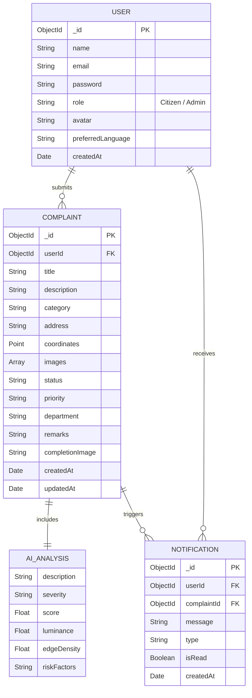

```mermaid
erDiagram
    USER ||--o{ COMPLAINT : submits
    USER ||--o{ NOTIFICATION : receives
    COMPLAINT ||--|| AI_ANALYSIS : includes
    COMPLAINT ||--o{ NOTIFICATION : triggers

    USER {
        ObjectId _id PK
        String name
        String email
        String password
        String role "Citizen / Admin"
        String avatar
        String preferredLanguage
        Date createdAt
    }

    COMPLAINT {
        ObjectId _id PK
        ObjectId userId FK
        String title
        String description
        String category
        String address
        Point coordinates
        Array images
        String status
        String priority
        String department
        String remarks
        String completionImage
        Date createdAt
        Date updatedAt
    }

    AI_ANALYSIS {
        String description
        String severity
        Float score
        Float luminance
        Float edgeDensity
        String riskFactors
    }

    NOTIFICATION {
        ObjectId _id PK
        ObjectId userId FK
        ObjectId complaintId FK
        String message
        String type
        Boolean isRead
        Date createdAt
    }
```
