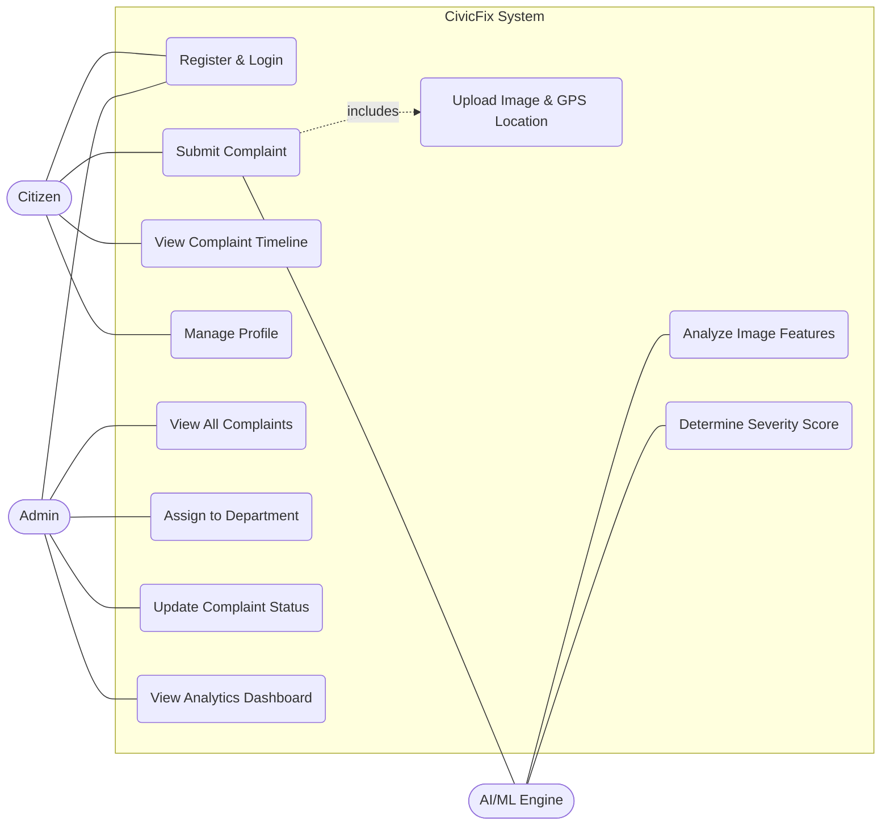

```mermaid
flowchart LR
    %% Actors
    Citizen([Citizen])
    Admin([Admin])
    AI([AI/ML Engine])

    %% System Boundary
    subgraph CivicFix System
        UC1(Register & Login)
        UC2(Submit Complaint)
        UC3(Upload Image & GPS Location)
        UC4(View Complaint Timeline)
        UC5(Manage Profile)
        
        UC6(Analyze Image Features)
        UC7(Determine Severity Score)
        
        UC8(View All Complaints)
        UC9(Assign to Department)
        UC10(Update Complaint Status)
        UC11(View Analytics Dashboard)
    end

    %% Relationships - Citizen
    Citizen --- UC1
    Citizen --- UC2
    Citizen --- UC4
    Citizen --- UC5
    UC2 -.-> |includes| UC3
    
    %% Relationships - AI Engine
    UC2 --- AI
    AI --- UC6
    AI --- UC7

    %% Relationships - Admin
    Admin --- UC1
    Admin --- UC8
    Admin --- UC9
    Admin --- UC10
    Admin --- UC11
```
